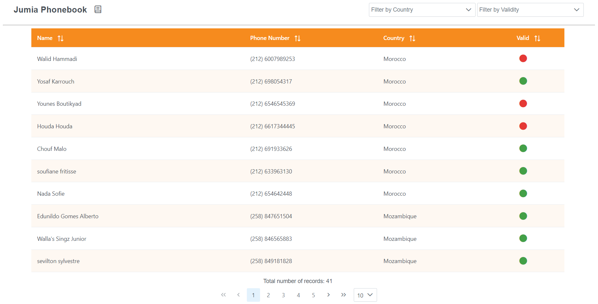
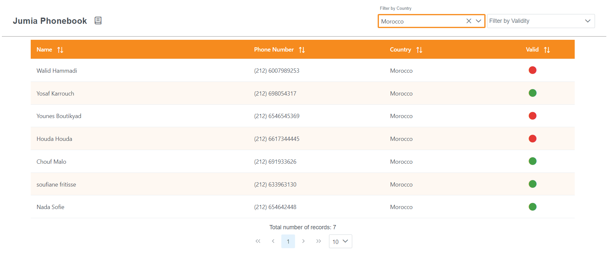
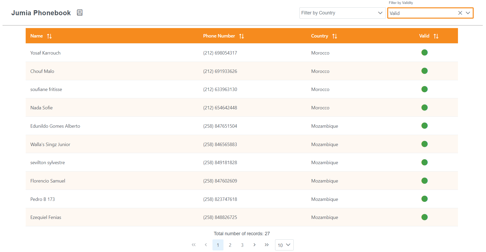
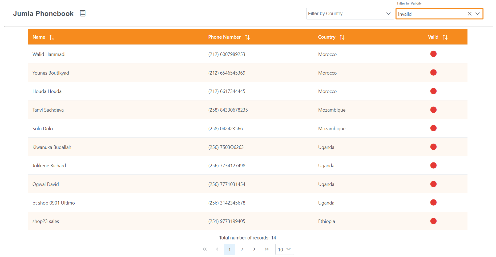
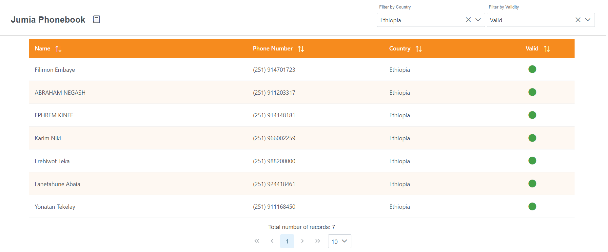
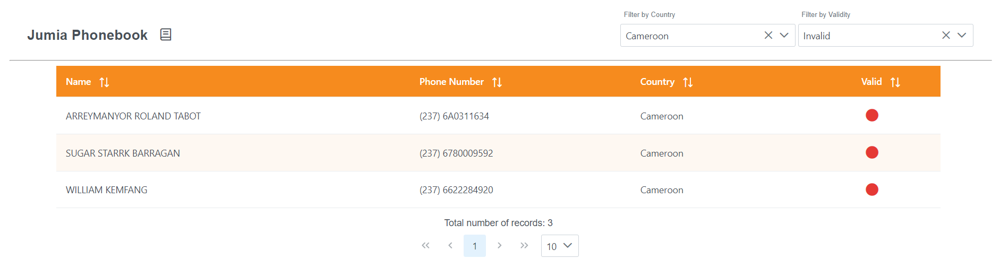
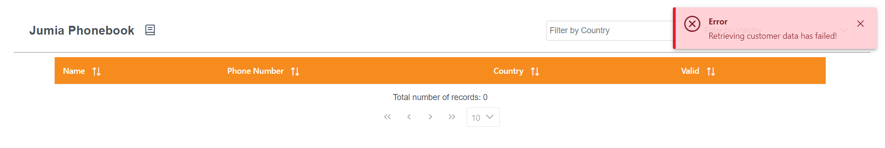
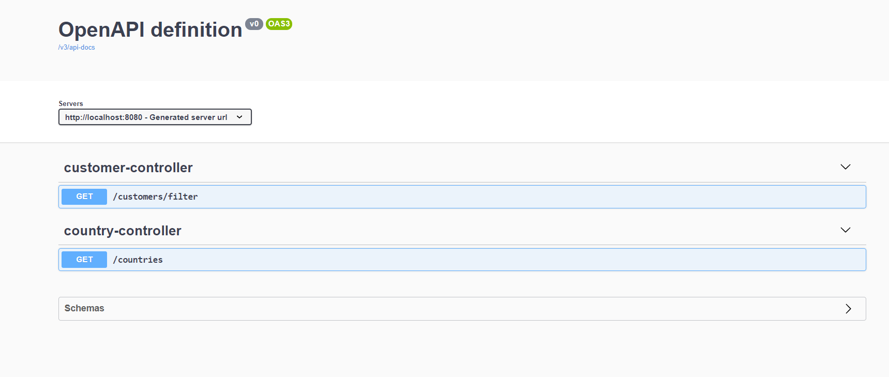

# Phone Numbers Validator App


<!-- TABLE OF CONTENTS -->
<details>
  <summary>Table of Contents</summary>
  <ol>
    <li>
      <a href="#about-the-project">About The Project</a>
      <ul>
        <li><a href="#built-with">Built With</a></li>
      </ul>
    </li>
    <li>
      <a href="#getting-started">Getting Started</a>
    </li>
    <li><a href="#project-structure">Project Structure</a></li>
    <li><a href="#key-challenges">Key Challenges</a></li>
    <li><a href="#enhancement-plan-for-the-application">Enhancement plan for the application</a></li>
    <li><a href="#usage">Usage</a></li>
    <li><a href="#screenshots">Screenshots</a></li>
  </ol>
</details>


<!-- ABOUT THE PROJECT -->
## About The Project

Lists and categorize country phone numbers, it also offers possibility to filter phone numbers by country and their state whether they are valid or not.

<p align="right">(<a href="#top">back to top</a>)</p>

### Built With

* [Spring Boot V2.4.6](https://spring.io/projects/spring-boot)
* [Spring Data JPA V2.4.6](https://spring.io/projects/spring-data-jpa)
* [Springdoc-openapi Java Library V1.5.2](https://springdoc.org/)
* [Spring Boot Starter Test V2.4.6](https://docs.spring.io/spring-boot/docs/1.5.7.RELEASE/reference/html/boot-features-testing.html)
* [Project Lombok V1.18.20](https://projectlombok.org/)
* [Model Mapper V2.3.5](http://modelmapper.org/getting-started/)
* [H2 Database V1.4.200](https://www.h2database.com/html/main.html)
* [Angular V12.0.0](https://angular.io/)
* [PrimeNG UI Component V12.2.0](https://www.primefaces.org/primeng/)

<p align="right">(<a href="#top">back to top</a>)</p>


<!-- GETTING STARTED -->
## Getting Started

The project can run either by running the JAR file or by building a docker image and run it.

### JAR File

1. Clone the repo
   ```sh
   git clone https://github.com/MarianMamdouh/phonebook.git
   ```
2. Move to /phonebook and run 
   ```sh
   mvn clean install
   ```
3. Move to /phonebook/phonebook-app/target and run 
   ```sh
   java -jar phonebook-app-0.1-SNAPSHOT.jar
   ```
4. The application is now up and can be accessed via  
   ```sh
   http://localhost:8080/
   ```
5. API Documentation can be accessed via  
   ```sh
   http://localhost:8080/swagger-ui/index.html?configUrl=/v3/api-docs/swagger-config
### DockerFile

1. Clone the repo
   ```sh
   git clone https://github.com/MarianMamdouh/phonebook.git
   ```
2. Move to /phonebook and run 
   ```sh
   mvn clean install
   ```
3. Move to /phonebook/phonebook-app and build a docker image with the name phone-app using 
   ```sh
   docker build -t phone-app .
   
4. At the same previous path run docker image on port 8080 using 
   ```sh
   docker run --rm -it -p 8080:8080 phone-app
   
5. The application is now up and can be accessed via  
   ```sh
   http://localhost:8080/
6. API Documentation can be accessed via  
   ```sh
   http://localhost:8080/swagger-ui/index.html?configUrl=/v3/api-docs/swagger-config
   

<p align="right">(<a href="#top">back to top</a>)</p>


<!-- PROJECT STRUCTURE -->
## Project structure

* phonebook-ui (FE using Angular):
    * Jumia phoneapp dashboard component which contains the logic and the styles for the single page app. 
    * Models to wrap the customer and country parts of the app.
    * Services where the requests sent to the backend are handled.
    * URLs config file to contain all of our URLs strings.

* phonebook-app (BE):
    * cache: building up country infos maps to be ease access for filtering and validating phone numebrs
    * controllers : contains customer controller to handle all the filteration, pagination and sorting requests
      and country controller to retrieve all of the country names to be used as a filter dropdown list in the UI part.
    * exception: An exception handler class to have one place where we choose how to handle our exceptions thrown 
          everywhere around the code and to specify a unified model for error response body
    * mapper: class to map the customer entity in the DB to another model by adding countryName field which is based on phone
          number prefix and a valid field which tells whether the phone number matches the country phone number regular expression or not
          for easier filtering operations and UI representation.
    * persistence/model: Holds cutomer entity our main entity which represents the customer in SQLite file that holds the customer id,
          name and phone number.
    * persistence/repository: The main repository which represents our DAO to help us access the db with different CRUD operations 
          but mainly we only need Retrieval  so we can get our customers as in page or as in list, filtered by phone number or not.
    * services: Holds our customer service layer where we can access our CustomerRepository to perform all the filtering operations needed,
          also it holds country service layer where we can access our counyryInfoCache and get countries names list to be used as a filter
          dropdown list in the UI part.
    * utlis: Pagination utility class to wrap our pageable object.
    * resources: application.properties file which contains basic configurations for the datasource and hibernate dialect,
          application-test.properties which holds the configuration of datasource for testing purposes.
    * test: holds some tests for our controllers and services.

<p align="right">(<a href="#top">back to top</a>)</p>


<!-- KEY CHALLENGES -->
## Key Challenges

* Treating the database as unmodifiable, which resulted in using model mapper to map our entity to DTO entity by adding phone number validty state
  and country name.

<p align="right">(<a href="#top">back to top</a>)</p>


<!-- ENHANCEMENT PLAN FOR THE APPLICATION -->
## Enhancement plan for the application

* Implement searcing functionalities.
* Add a support for creating regexp() function to make the REGEXP operator available in SQLite3 in order to 
  validting phone numbers using database instead of loading our whole data in our app memory and do the filtering ourselves.
* Security & validation enhancements.
* Adding logback.xml file.
<p align="right">(<a href="#top">back to top</a>)</p>


<!-- USAGE EXAMPLES -->
## Usage

Having cusomter data which includes their name and their phone number along with some predefined data about countries that includes
a country name, a country code number and regular expressions to validate the customer phone numbers, a single-page web app is created to 
list and categorize country phone numbers by country name, phone number and phone number state and here are some main features:

* Implement Filteration by country name, phone number state validity or both combined.
* Implement Pagination & Sorting with default values for each.
* API documentation using swagger.
* Unified error handling mechanism.
* Unit test for controllers & services.

<!-- USAGE EXAMPLES -->
## Screenshots

### Find all customers
<p float="left">
  
</p>

### Filters

<p float="left">
  <p>Filter by Morocco country name</p>
  
  <p>Filter by true validity</p>
  
  <p>Filter by false validity</p>
  
  <p>Filter by Ethiopia country name and true validity</p>
  
  <p>Filter by Cameroon country name and false validity</p>
  
</p>

### Error case

<p float="left">
  
</p>

### Swagger API Documentation

<p float="left">
  
</p>

<p align="right">(<a href="#top">back to top</a>)</p>
